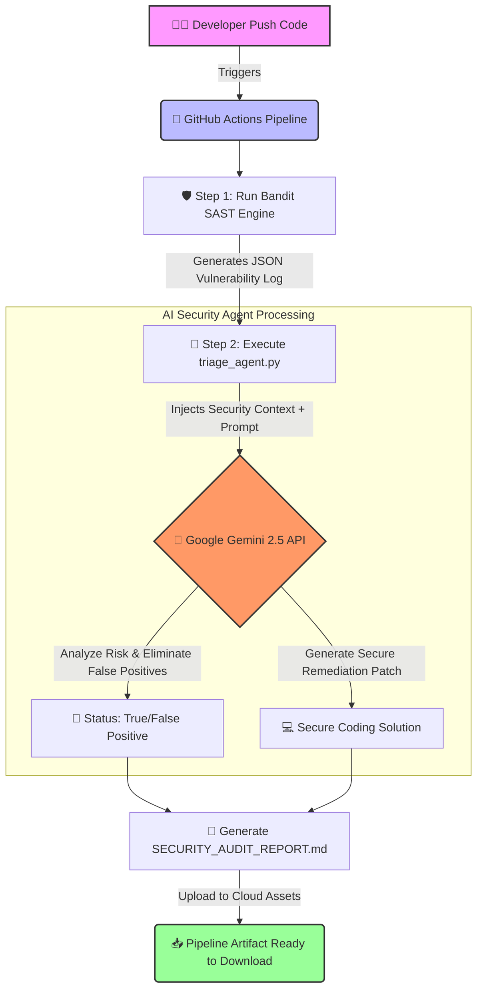

# 🤖 Autonomous GenAI-Driven SecDevOps Pipeline

An automated, self-triaging security orchestration pipeline integrated into GitHub Actions. This project implements the **"Shift-Left Security"** paradigm by combining static application security testing (SAST) with Large Language Models (LLMs) to automatically detect vulnerabilities, eliminate false positives, and generate secure remediation patches in real-time.

---

## 📊 Pipeline Architecture & Workflow

GitHub will automatically render the syntax below into an elegant, color-coded interactive flowchart viewable by recruiters and engineering managers:


📝 Step-by-Step Execution

    Continuous Integration Trigger: Every code push or pull request to the main branch automatically provisions an isolated Ubuntu runner environment via GitHub Actions.

    SAST Code Scanning: The core engine executes Bandit, scanning the codebase for dangerous functions, hardcoded credentials, and common secure coding flaws, outputting raw results into a structured JSON log.

    Context-Aware Ingestion: The triage_agent.py script parses the JSON findings, isolates the vulnerable code chunks, and constructs a precise, context-heavy cryptographic and logic boundary prompt.

    LLM Triaging & Remediation: The agent securely queries the Google Gemini 2.5 API using credentials securely mounted from GitHub Secrets. The model analyzes whether the finding is a true vulnerability or a false positive and creates optimal remediation code.

    Artifact Generation: A professional audit document (SECURITY_AUDIT_REPORT.md) is compiled and archived as a pipeline artifact, ready for consumption by security assessors.

✨ Features

    Automated Secure-SDLC: Full automation of code auditing upon every developer workspace update.

    Intelligent Vulnerability Triaging: Cuts down human analyst manual review hours by pre-filtering raw alerts with advanced LLM logic.

    AI-Powered Hot-Patching: Provides production-ready, secure code replacements rather than just pointing out problems.

    Enterprise Secret Management: Zero token leakage; fully protected under GitHub Repository Encrypted Secrets.

🚀 Technical Stack

    Language: Python 3.x

    Orchestration: GitHub Actions (CI/CD workflows)

    Security Scanner: Bandit (Static Application Security Testing)

    AI Core: Google GenAI SDK (Gemini 2.5 API Engine)

🛠️ Installation & Setup
1. Repository Configuration

Clone this repository to your local testing environment:
Bash

git clone https://github.com/YounJungie/genai-secdevops-pipeline.git
cd genai-secdevops-pipeline

2. GitHub Secrets Provisioning

To enable cloud execution, you must supply the LLM orchestration layer with valid API tokens:

    Go to your GitHub Repository Settings -> Secrets and variables -> Actions.

    Click New repository secret.

    Add the following variable:

        Name: GEMINI_API_KEY

        Value: [Your Private Google Gemini API Token]

3. Local Evaluation (Optional)

If you wish to debug the triage script locally, establish your environmental variables and dependencies:
Bash

pip install -r requirements.txt
export GEMINI_API_KEY="your_api_key_here"
python triage_agent.py

📄 Automated Output Sample

Upon a successful pipeline run, the AI outputs a highly structured SECURITY_AUDIT_REPORT.md following this operational specification:
Markdown

# 🛡️ SECURITY TRIAGE AUDIT REPORT

## [HIGH] CWE-259: Hardcoded Password Detected
* **File:** `app.py` | **Line:** 14
* **AI Analysis:** TRUE POSITIVE. The source code contains a static string assignment assigned to a database connection parameter.
* **Remediation Patch:**

```python
# SECURE REFACTORING:
import os
db_password = os.environ.get("DB_PASSWORD")

Developed with an adversarial mindset for modern DevSecOps integration.
